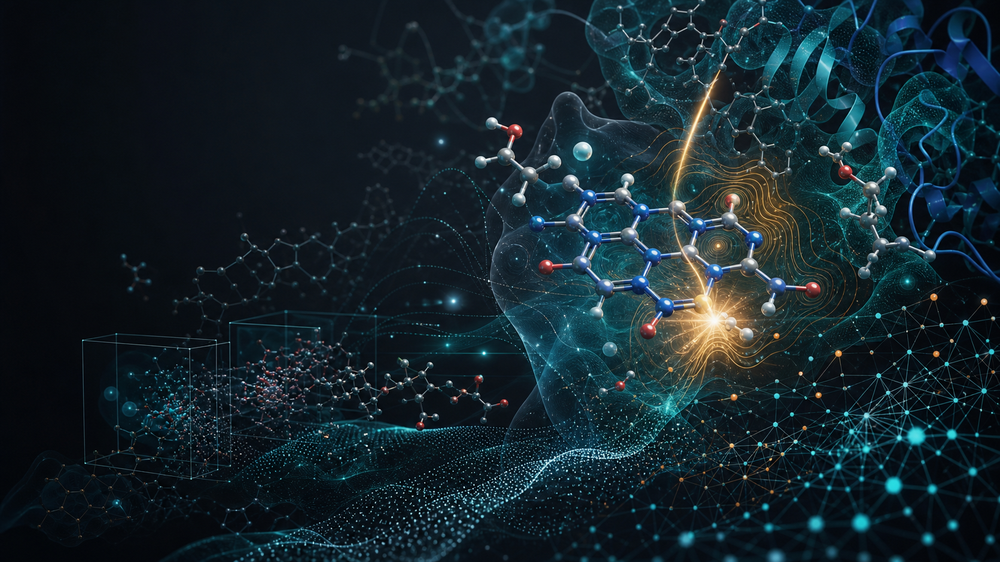

```{=html}
<a class="skip-link" href="#main-content">Skip to content</a>

<section class="hero-v2" id="main-content">
  <div>
    <p class="eyebrow">Kabir Computational Molecular Science Lab</p>
    <h1>Computing how molecular environments control light, reactivity, and recognition.</h1>
    <p class="lead-copy">We combine quantum chemistry, molecular dynamics, QM/MM, and automated workflows to understand molecular behavior in proteins, solvents, and functional materials.</p>
    <p>Department of Chemistry and Forensic Science<br>Savannah State University</p>
    <div class="hero-actions">
      <a class="btn-lab" href="research/">Explore Research <i class="bi bi-arrow-right" aria-hidden="true"></i></a>
      <a class="btn-lab secondary" href="join/">Join the Lab <i class="bi bi-people" aria-hidden="true"></i></a>
    </div>
    <a class="hero-text-link" href="publications/">View publications <i class="bi bi-arrow-right" aria-hidden="true"></i></a>
  </div>
  <figure class="hero-visual">
    
    <figcaption>Electrostatic environment and interaction hot spots around a flavin chromophore from QM/MM modeling.</figcaption>
  </figure>
</section>

<section class="home-research-strip" aria-label="Research directions">
  <a class="home-research-tile" href="research/photophysics/">
    <span class="home-tile-icon"><i class="bi bi-brightness-high" aria-hidden="true"></i></span>
    <span>
      <strong>Excited-State and Redox Chemistry</strong>
      <small>Electronic structure and spectroscopy of photoactive and redox-active molecules in complex environments.</small>
      <i class="bi bi-arrow-right tile-arrow" aria-hidden="true"></i>
    </span>
  </a>
  <a class="home-research-tile" href="research/multiscale-workflows/">
    <span class="home-tile-icon"><i class="bi bi-diagram-3" aria-hidden="true"></i></span>
    <span>
      <strong>Molecular Dynamics and QM/MM</strong>
      <small>Multiscale simulations connecting quantum chemistry with molecular dynamics to model real systems.</small>
      <i class="bi bi-arrow-right tile-arrow" aria-hidden="true"></i>
    </span>
  </a>
  <a class="home-research-tile" href="research/interactions-materials/">
    <span class="home-tile-icon"><i class="bi bi-fingerprint" aria-hidden="true"></i></span>
    <span>
      <strong>Interaction Maps and Automated Workflows</strong>
      <small>Automated protocols for interaction mapping, free-energy calculations, and reproducible computational science.</small>
      <i class="bi bi-arrow-right tile-arrow" aria-hidden="true"></i>
    </span>
  </a>
</section>
```
