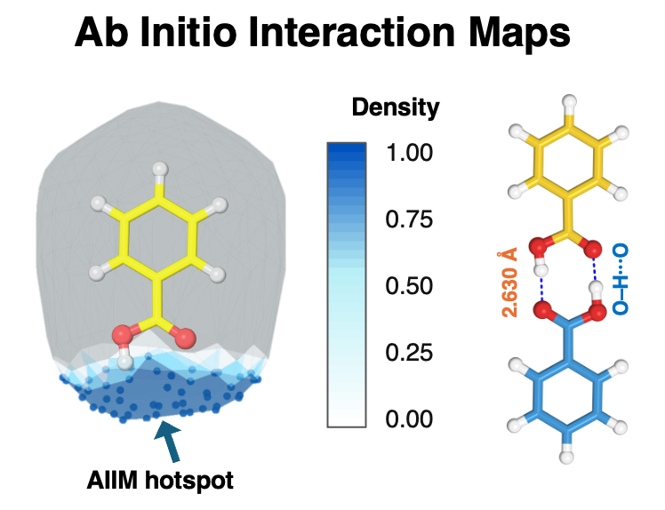
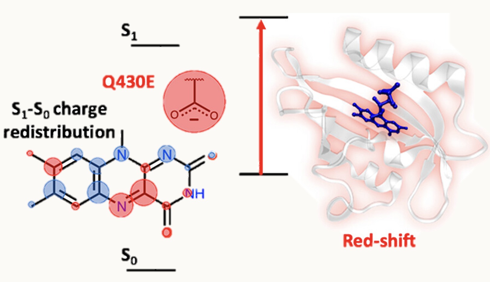
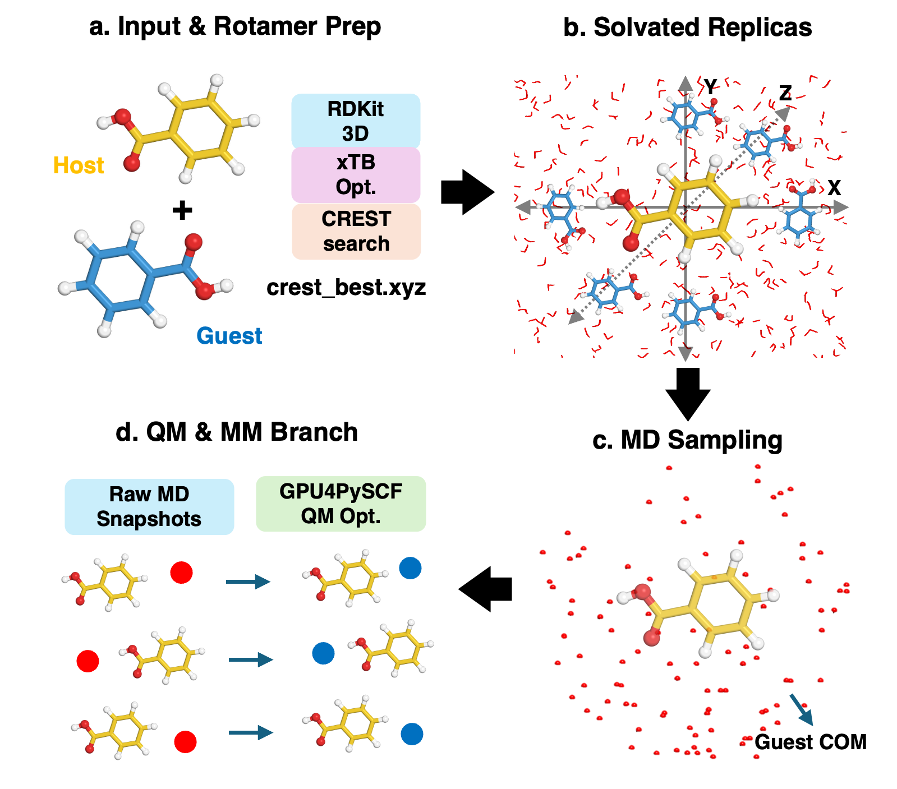
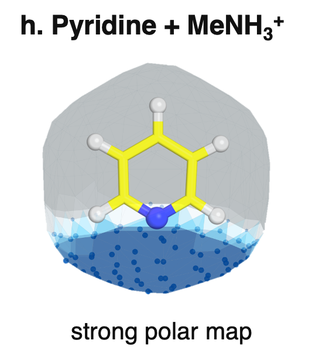

```{=html}
<a class="skip-link" href="#main-content">Skip to content</a>

<section class="home-hero-panel" id="main-content">
  <div class="home-hero-copy">
    <p class="eyebrow">Kabir Computational Molecular Science Lab</p>
    <h1>Computing how molecular environments control light, reactivity, and recognition.</h1>
    <p class="lead-copy">We combine quantum chemistry, molecular dynamics, QM/MM, photophysics, and automated workflows to understand how complex environments shape molecular behavior from proteins and cofactors to functional materials.</p>
    <div class="hero-actions">
      <a class="btn-lab" href="research/">Explore Our Research</a>
      <a class="btn-lab secondary" href="publications/">View Publications</a>
    </div>
    <p class="home-location">
      <i class="bi bi-bank" aria-hidden="true"></i>
      <span>Department of Chemistry and Forensic Science<br>Savannah State University &bull; Savannah, Georgia, USA</span>
    </p>
  </div>
  <figure class="home-hero-figure">
    
    <figcaption>Ab Initio Interaction Maps highlight favorable interaction regions and molecular-recognition geometry around functional chromophores.</figcaption>
  </figure>
</section>

<section class="home-research-cards" aria-label="Research directions">
  <article class="home-research-card">
    <div class="home-card-heading">
      <span class="home-section-number">1</span>
      <h2>Molecular Photophysics in Complex Environments</h2>
    </div>
    
    <p>We investigate electronically excited states, charge redistribution, and environment-induced shifts in flavin and related chromophores within proteins and solvents.</p>
    <a href="research/photophysics/">Learn more <i class="bi bi-arrow-right" aria-hidden="true"></i></a>
  </article>
  <article class="home-research-card">
    <div class="home-card-heading">
      <span class="home-section-number">2</span>
      <h2>Multiscale Simulation and Reproducible Workflows</h2>
    </div>
    
    <p>We integrate molecular dynamics, QM/MM, and automated workflows to enable reproducible, high-throughput studies of complex systems with open, transparent methods.</p>
    <a href="research/multiscale-workflows/">Learn more <i class="bi bi-arrow-right" aria-hidden="true"></i></a>
  </article>
  <article class="home-research-card">
    <div class="home-card-heading">
      <span class="home-section-number">3</span>
      <h2>Molecular Interactions and Functional Design</h2>
    </div>
    
    <p>We quantify noncovalent interactions and design ligands and cofactors through polar maps, hotspot analysis, and structure-function relationships.</p>
    <a href="research/interactions-materials/">Learn more <i class="bi bi-arrow-right" aria-hidden="true"></i></a>
  </article>
</section>

<section class="home-info-grid" aria-label="Lab highlights">
  <article class="home-info-panel">
    <h2><i class="bi bi-journal-text" aria-hidden="true"></i>Selected Publications</h2>
    <ul class="compact-list">
      <li><strong>ACS Appl. Energy Mater.</strong> 2025: multipathway emission in 9-fluorenone derivatives.</li>
      <li><strong>J. Phys. Chem. B</strong> 2024: electronic-structure methods for flavin spectroscopy.</li>
      <li><strong>J. Phys. Chem. B</strong> 2023: spectral tuning of flavin-binding fluorescent proteins.</li>
    </ul>
    <a href="publications/">View all publications <i class="bi bi-arrow-right" aria-hidden="true"></i></a>
  </article>
  <article class="home-info-panel">
    <h2><i class="bi bi-code-slash" aria-hidden="true"></i>Open Workflows</h2>
    <ul class="compact-list">
      <li>Ab-Initio Interaction Map for noncovalent interaction analysis.</li>
      <li>QM/MM protocol resources for flavoprotein spectral tuning.</li>
      <li>Electrostatic spectral-tuning maps and sampling workflows.</li>
    </ul>
    <a href="software/">Explore resources <i class="bi bi-arrow-right" aria-hidden="true"></i></a>
  </article>
  <article class="home-info-panel">
    <h2><i class="bi bi-people-fill" aria-hidden="true"></i>Join the Lab</h2>
    <ul class="check-list">
      <li>Undergraduate research opportunities in computational chemistry.</li>
      <li>Training in molecular modeling, coding, and reproducible workflows.</li>
      <li>Collaborative mentoring for motivated student researchers.</li>
    </ul>
    <a href="join/">Research opportunities <i class="bi bi-arrow-right" aria-hidden="true"></i></a>
  </article>
</section>
```
