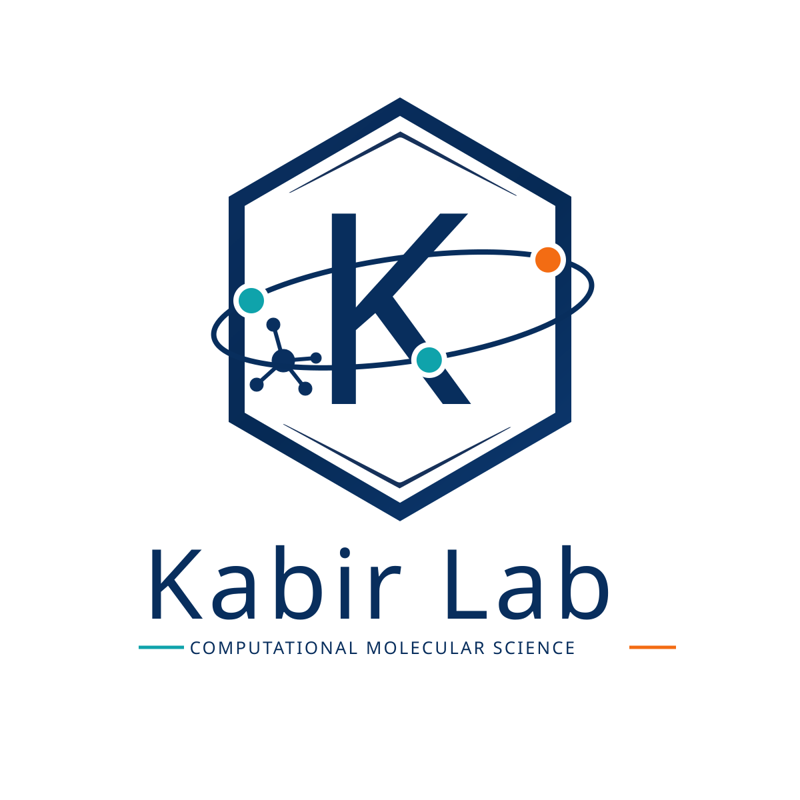
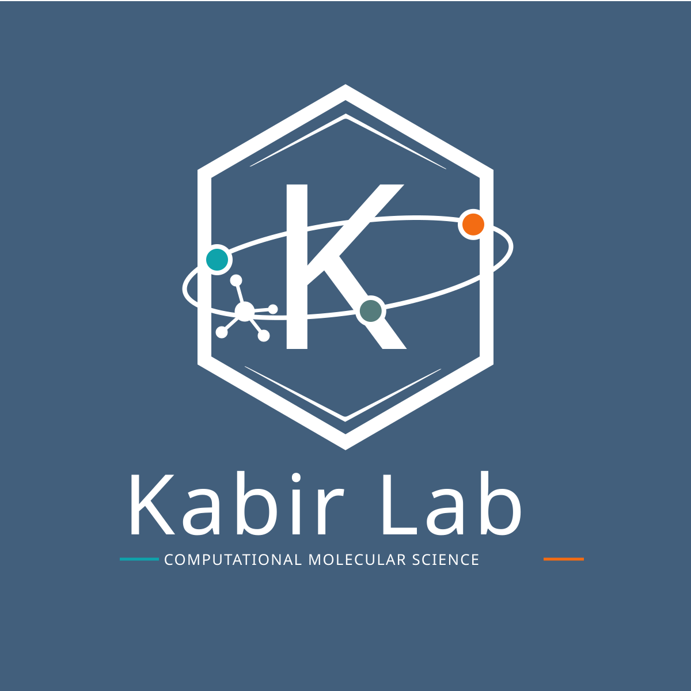

# Software & Resources

These resources are public research workflows or related contributions. Repository maturity labels are conservative until the PI confirms current maintenance status.

## Logo

Official Kabir Lab logo files for approved website, presentation, poster, and research communication use.

::: {.software-grid .logo-resource-grid}
::: {.software-card .logo-resource-card}
### Refined Logo

  

White-background SVG with full Kabir Lab wordmark and computational molecular science tagline.

<a class="btn-lab secondary resource-download" href="../assets/brand/kabir_lab_logo_refined.svg" download>Download SVG</a>
:::

::: {.software-card .logo-resource-card}
### Refined Logo, Dark

  

Dark-background SVG with full Kabir Lab wordmark and computational molecular science tagline.

<a class="btn-lab secondary resource-download" href="../assets/brand/kabir_lab_logo_refined1.svg" download>Download SVG</a>
:::
:::

## Kabir Lab Software And Workflows

::: {.software-grid}
::: {.software-card}
### Ab-Initio Interaction Map

**Purpose:** Automated protocol for generating three-dimensional interaction maps between molecular partners from structural inputs.

**Maturity:** research workflow / fork of Liu Group repository  
**Constraints:** AMBER16 or newer, Packmol, Python 2.7-era dependencies, `pyvdwsurface`  
**License:** MIT

[Repository](https://github.com/pabelkabir/Ab-Initio-Interaction-Map)
:::

::: {.software-card}
### Electrostatic Spectral Tuning Maps

**Purpose:** Workflow for computing van der Waals surface points and electrostatic spectral tuning maps from molecular coordinates.

**Maturity:** research workflow / legacy protocol  
**Constraints:** Python 2.7, NumPy, Matplotlib, Cython, `pyvdwsurface`, Gaussian workflow scripts  
**License:** MIT

[Repository](https://github.com/pabelkabir/Electrostatic-Spectral-Tuning-Maps)
:::

::: {.software-card}
### QM/MM Protocol For Flavoproteins

**Purpose:** APEC-style QM/MM protocol for modeling flavoprotein environments and chromophore electronic states.

**Maturity:** research workflow / legacy protocol  
**Constraints:** Dowser, Modeller, SCWRL4, Molcas 7.8, Tinker 5, VMD, Gromacs, cluster-specific scripts  
**License:** not declared in repository metadata at review time

[Repository](https://github.com/pabelkabir/QM-MM-Protocol-for-Flavoproteins)
:::
:::

## Collaborative Software Contributions

::: {.software-grid}

::: {.software-card}
### Workflow For Umbrella Sampling

**Purpose:** Protocol for umbrella sampling simulations and PMF generation as a function of center-of-mass distance between molecules.

**Maturity:** research workflow / fork of Liu Group repository  
**Constraints:** AMBER16 or newer, AutoSolvate, Packmol, WHAM  
**License:** MIT

[Repository](https://github.com/pabelkabir/Workflow-for-Umbrella-Sampling)
:::

::: {.software-card}
### AutoSolvate

**Purpose:** Automated workflow for setting up explicit-solvent quantum chemistry calculations for molecules.

**Maturity:** related contribution / fork of Liu Group project  
**Constraints:** Use Liu Group documentation for canonical installation and usage.  
**License:** BSD 3-Clause

[Kabir fork](https://github.com/pabelkabir/AutoSolvate)  
[Liu Group project](https://github.com/Liu-group/AutoSolvate)
:::
:::

## Student Onboarding Resources

Students joining computational projects typically begin with Linux command-line work, Python scripting, molecular visualization, version control, and careful research notebooks. Public training materials will be added here after they are approved for reuse.
